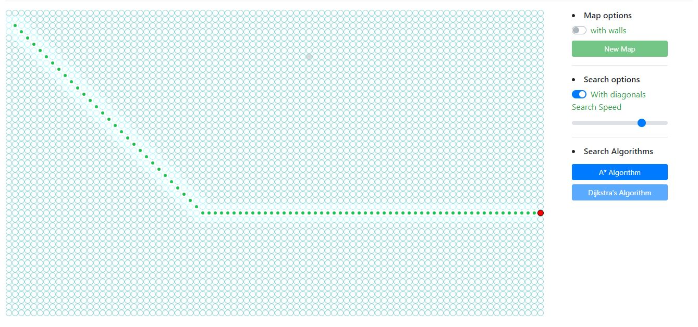

<!--
*** Thanks for checking out this README Template. If you have a suggestion that would
*** make this better, please fork the repo and create a pull request or simply open
*** an issue with the tag "enhancement".
*** Thanks again! Now go create something AMAZING! :D
-->


<!-- PROJECT SHIELDS -->
<!--
*** I'm using markdown "reference style" links for readability.
*** Reference links are enclosed in brackets [ ] instead of parentheses ( ).
*** See the bottom of this document for the declaration of the reference variables
*** for contributors-url, forks-url, etc. This is an optional, concise syntax you may use.
*** https://www.markdownguide.org/basic-syntax/#reference-style-links
-->


<!-- PROJECT LOGO -->
<br />
<p align="center">
  <a href="https://pathfinderjs.herokuapp.com/">
    
  </a>

  <h3 align="center">PathFinderJS</h3>

  <p align="center">
    Path finder algorithmes visiualisation with JavaScript
    <br />
  <a href="https://pathfinderjs.herokuapp.com/"><strong>Preview App</strong></a>
    <br />
  </p>
</p>


<!-- ABOUT THE PROJECT -->
## About The Project

[![MIT License][license-shield]][license-url]
[![LinkedIn][linkedin-shield]][linkedin-url]



<p>Path finder algorithmes are very used when we talk about web development or software engineering in general , each algorithme has it own way to calculate the shortest path between tow point in a given map , in this web application i tried to visualise some of these algorithmes using javascript .</p>

<h3>Used algorithmes :</h3>
<ul> 
  <li>A * (A star ) Algorithme </li>
  <li>Dijkstra Algorithme </li>
</ul>


<h3>Used technologies :</h3>
<ul> 
  <li>JavaScript</li>
  <li>Bootstrap </li>
  <li>CSS </li>
  <li>HTML5</li>
</ul>


<!-- LICENSE -->
<h3>A* algorithme with JavaScript :</h3>

```javascript
  
  async function astar() {
  if (start == null) {
    createStats("alert-danger", "Start point is missing !");
    return;
  }

  if (end == null) {
    createStats("alert-danger", "End point is missing !");
    return;
  }

  while (openSet.length > 0) {
    
    var winner = 0;
    for (i = 0; i < openSet.length; i++) {
      if (openSet[i].f < openSet[winner].f) {
        winner = i;
      }
    }

    var current = openSet[winner];

    if (current === end) {
      path = [];
      var tmp = current;
      path.push(tmp);
      while (tmp.previous) {
        path.push(tmp.previous);
        tmp = tmp.previous;
      }

      for (i = path.length - 1; i > 0; i--) {
        path[i].update("path");
        await sleep(pathSpeed);
      }

      createStats("alert-success", "We found the target point ");
      return;
    }

    removeSpot(openSet, current);

    for (i = 0; i < openSet.length; i++) openSet[i].update("checking");
    closeSet.push(current);
    for (i = 0; i < closeSet.length; i++) closeSet[i].update("visited");

    var nieghbors = current.nieghbors;
    for (i = 0; i < nieghbors.length; i++) {
      var nieghbor = nieghbors[i];

      if (!closeSet.includes(nieghbor) && !nieghbor.isWall) {
        var tmpG = nieghbor.g + 1;

        if (openSet.includes(nieghbor)) {
          if (tmpG < nieghbor.g) {
            nieghbor.g = tmpG;
          }
        } else {
          nieghbor.g = tmpG;
          openSet.push(nieghbor);
        }

        nieghbor.h = heuristic(nieghbor.returnElement(), end.returnElement());
        nieghbor.f = nieghbor.g + nieghbor.h;
        nieghbor.previous = current;
      }
    }

    await sleep(searchSpeed);
  }

  createStats("alert-info", "We coudn't find you target point ");
}
```  
  

<!-- CONTACT -->
## Contact

Project Link: [https://github.com/benharrimohamed/Rick-and-morty](https://github.com/benharrimohamed/Rick-and-morty)

[license-shield]: https://img.shields.io/github/license/othneildrew/Best-README-Template.svg?style=flat-square
[license-url]: https://github.com/othneildrew/Best-README-Template/blob/master/LICENSE.txt
[linkedin-shield]: https://img.shields.io/badge/-LinkedIn-black.svg?style=flat-square&logo=linkedin&colorB=555
[linkedin-url]: https://linkedin.com/in/mohammed-ben-harri-059734143

